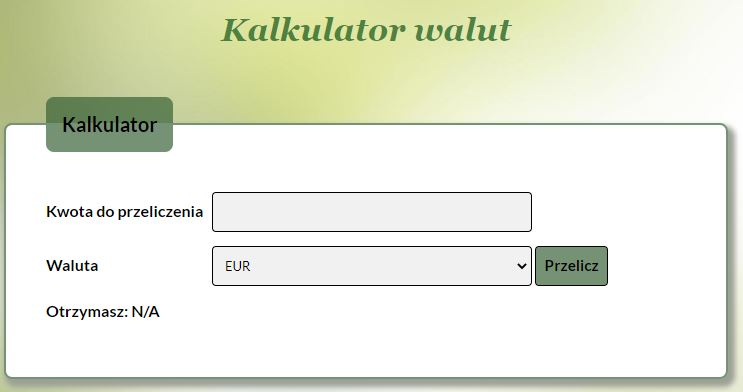

# Currency-Converter

## Demo 
https://sylwiahodurek.github.io/Currency-Converter/

### About project 

It's a very simple app which helps you to recalculate currencies. Application consisting of three currencies: EUR, NOK, SEK. 
If you want to calculate how much you will get e.g. in EUR, just enter your amount in the first field and click convert button. 

Plese note that application is in Polish and convertion is from Polish currency!
